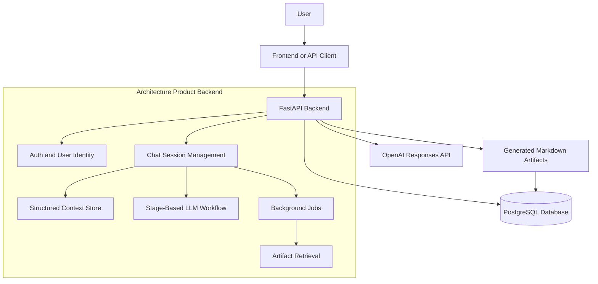
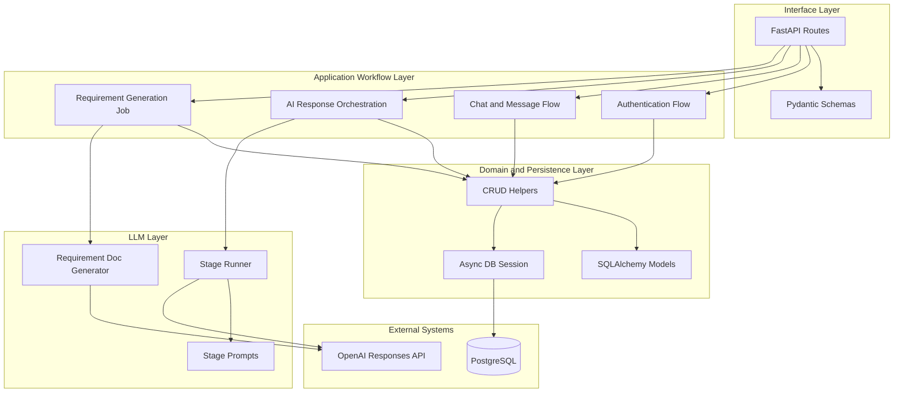
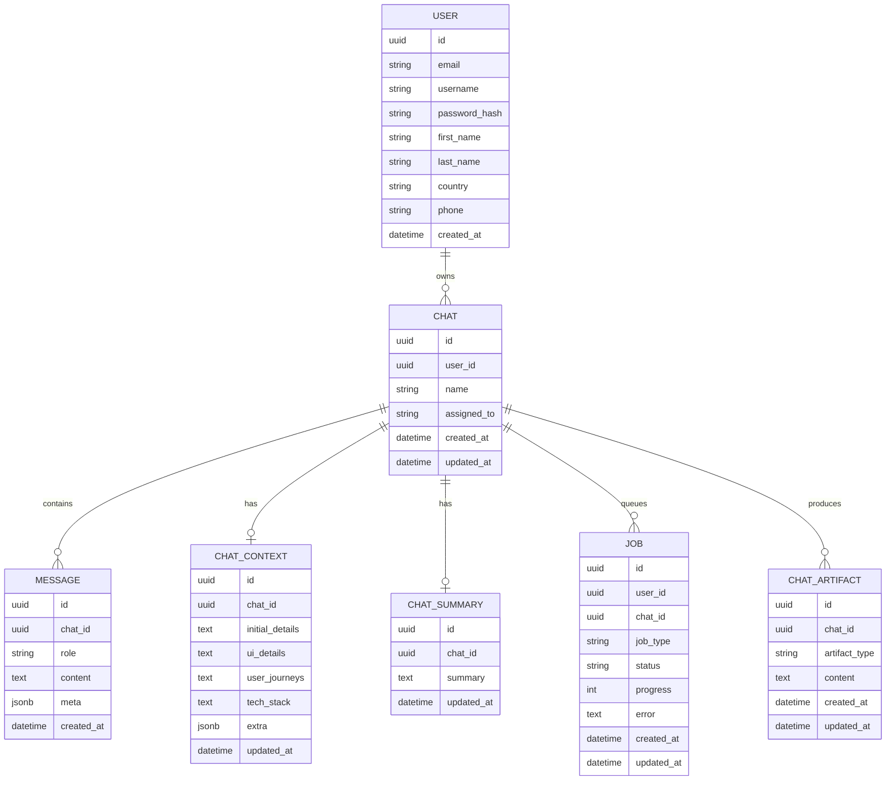
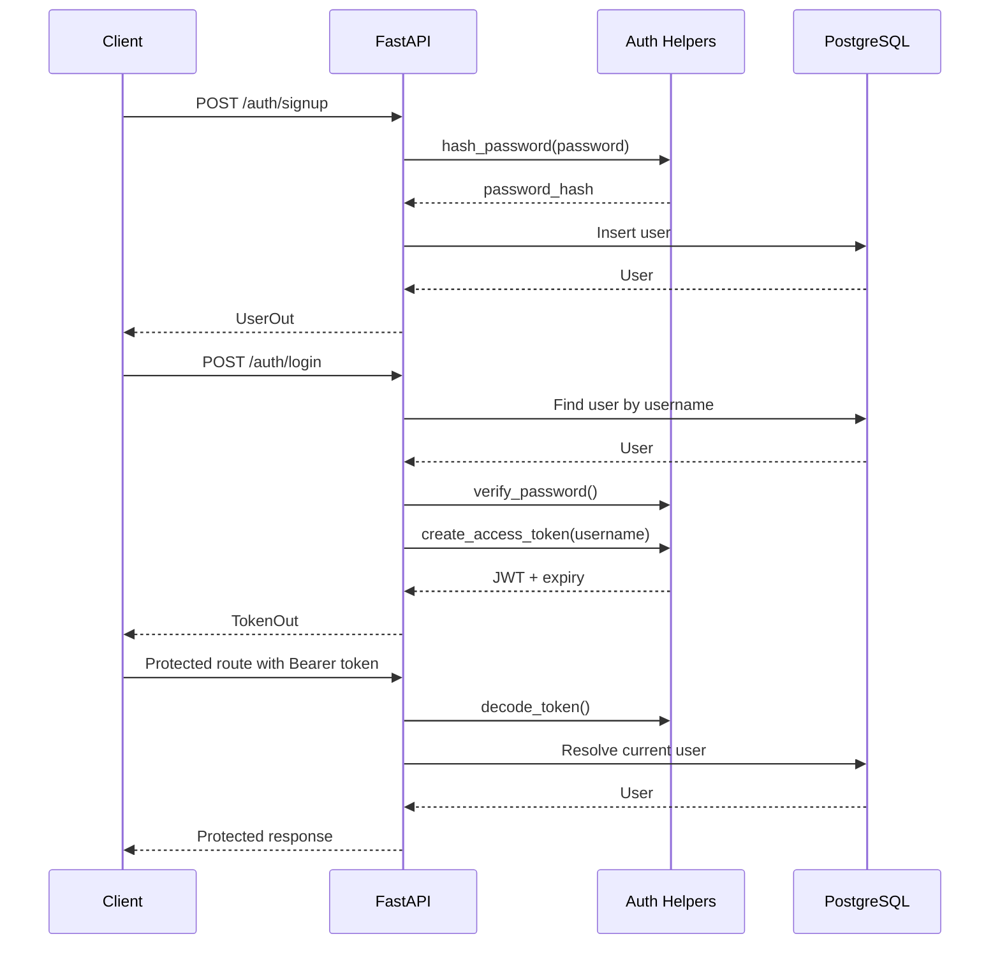
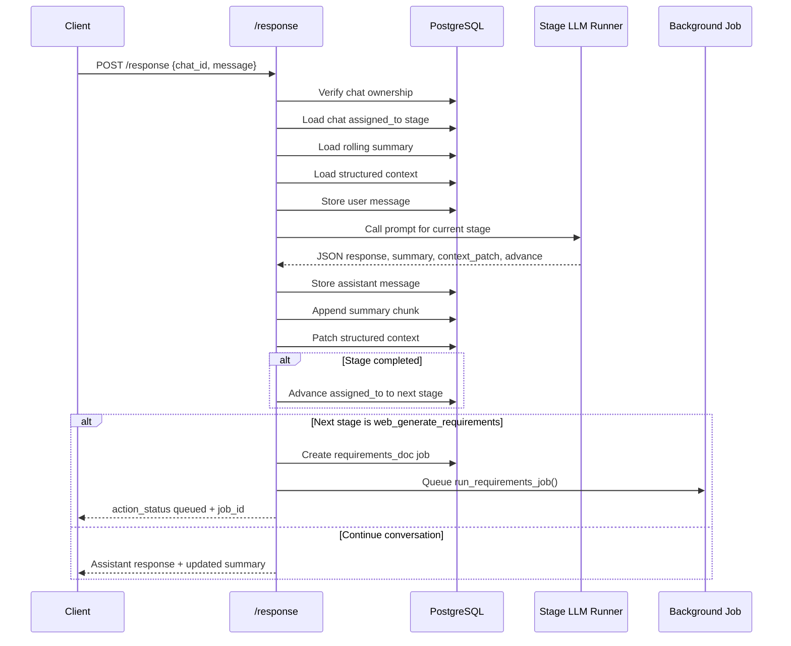
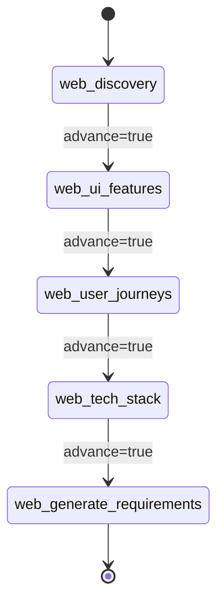
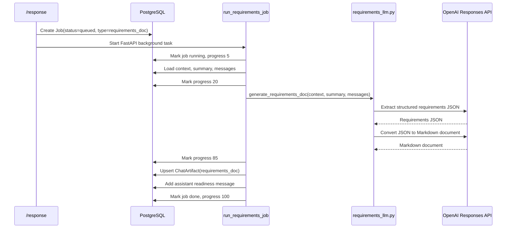
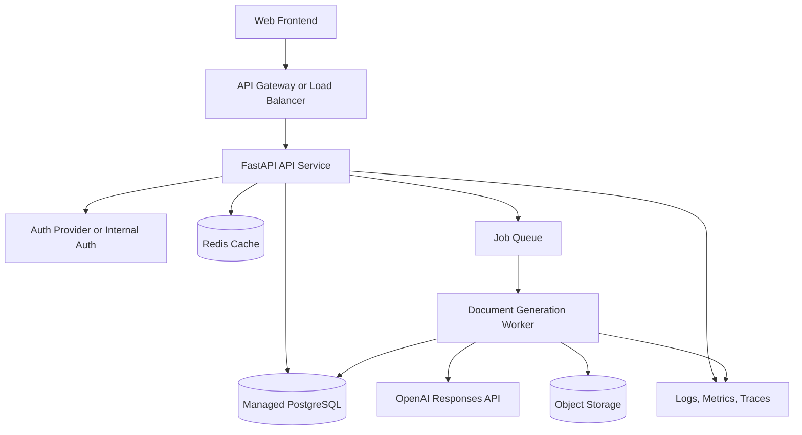

# Architecture Documentation

This document describes the architecture of Architecture Product, a FastAPI backend for an AI-assisted architecture planning workflow.

The system is currently a concept/MVP backend. Its purpose is to guide users through product discovery, capture architecture-relevant context, and generate requirement documentation from the conversation.

## Architecture Goals

- Convert vague product ideas into structured architecture inputs.
- Keep the user experience conversational instead of form-heavy.
- Ask focused questions in a fixed sequence of discovery stages.
- Persist both raw conversation history and structured context.
- Use LLMs for guided questioning, summarization, context extraction, and document generation.
- Generate reusable Markdown artifacts from a completed conversation.

## System Context



At the highest level, the backend acts as the product brain. It owns authentication, chat state, stage progression, persistence, and calls to the LLM provider.

## Runtime Components

| Component | File(s) | Responsibility |
| --- | --- | --- |
| FastAPI app | `app/main.py` | Defines HTTP routes, starts database table creation, coordinates request flow. |
| Settings | `app/settings.py` | Provides database and JWT configuration through Pydantic settings. |
| Database session | `app/db.py` | Creates async SQLAlchemy engine and session factories. |
| Auth helpers | `app/auth.py`, `app/deps.py` | Hashes passwords, creates JWTs, decodes bearer tokens, resolves current user. |
| Domain models | `app/models.py` | Defines users, chats, messages, context, summaries, jobs, and artifacts. |
| API schemas | `app/schemas.py` | Defines request and response contracts using Pydantic. |
| CRUD layer | `app/crud.py`, `app/crud_jobs.py`, `app/crud_artifacts.py` | Encapsulates database operations. |
| Web LLM stages | `app/llm/web_stages.py` | Defines the stage order for the web architecture workflow. |
| Web LLM runner | `app/llm/web_runner.py` | Selects the right prompt and calls the OpenAI Responses API. |
| Prompt templates | `app/web_llm_prompts/*` | Defines behavior for discovery, UI signals, journeys, and tech-stack stages. |
| Requirement job | `app/workflows/requirements_job.py` | Runs background document generation and stores the output artifact. |
| Requirement LLM | `app/llm/requirements_llm.py` | Performs two LLM calls: extract structured requirements, then create Markdown. |

## Layered View



The codebase follows a practical route-service-persistence structure, although it is not split into formal service classes yet. `app/main.py` currently performs route handling and orchestration.

## Data Model



### Why Conversation State Is Split

The project stores conversation state in three forms:

| State | Storage | Why it exists |
| --- | --- | --- |
| Raw messages | `messages` | Keeps the exact conversation available for audit, display, and later generation. |
| Rolling summary | `chat_summary` | Keeps compact durable memory for LLM prompts without resending all history. |
| Structured context | `chat_context` | Stores architecture-relevant extracted facts in fields the backend can reason about. |

This separation is important for an architecture assistant. Raw chat alone is too noisy, summary alone is too lossy, and structured context alone does not preserve the full discussion.

## Authentication Flow



Passwords are hashed with Argon2. JWT tokens use a subject claim containing the username. Protected routes depend on `get_current_user`.

## Main Conversation Flow

The `/response` endpoint is the core product workflow.



The endpoint treats the LLM as a stage worker. The LLM does not directly mutate the database. It returns structured instructions, and the backend applies them.

## Stage Pipeline



### Stage 1: `web_discovery`

Prompt file: `app/web_llm_prompts/web_discovery.py`

Purpose:

- Understand the product idea.
- Identify product type and core goal.
- Capture primary user roles or early assumptions.
- Identify major constraints such as region, language, scale, or compliance.
- Move to UI and feature signals once discovery is good enough.

Context field updated:

- `initial_details`

### Stage 2: `web_ui_features`

Prompt file: `app/web_llm_prompts/web_ui_features.py`

Purpose:

- Capture high-level UI direction only where it affects backend design.
- Identify major pages and screens.
- Identify feature scope.
- Identify admin and user-facing areas.
- Avoid deep visual design discussion.

Context field updated:

- `ui_details`

### Stage 3: `web_user_journeys`

Prompt file: `app/web_llm_prompts/web_user_journeys.py`

Purpose:

- Define practical user roles.
- Capture core actions per role.
- Identify how users move through the system.
- Provide enough detail to inform database schema, API design, and permissions.

Context field updated:

- `user_journeys`

### Stage 4: `web_tech_stack`

Prompt file: `app/web_llm_prompts/web_tech_stack.py`

Purpose:

- Ask for budget, timeline, and stack preference.
- Recommend a primary and fallback build approach.
- Align the user on platform versus custom build direction.
- Trigger final requirement document generation after approval.

Context field updated:

- `tech_stack`

### Stage 5: `web_generate_requirements`

This is not a conversational prompt stage in the same way as the previous four stages. It is the handoff point where the backend creates a background job and generates a requirement document.

## Requirement Document Generation Flow



The generator intentionally uses two LLM calls:

1. A product analyst style extraction call that produces structured requirement JSON.
2. A solutions architect style writing call that produces the final Markdown document.

This two-step design improves separation between extraction and presentation.

## API Surface

### Authentication

| Method | Path | Description | Auth |
| --- | --- | --- | --- |
| `POST` | `/auth/signup` | Create a user account. | No |
| `POST` | `/auth/login` | Authenticate and return bearer token. | No |
| `GET` | `/auth/me` | Return current authenticated user. | Yes |

### Chats

| Method | Path | Description | Auth |
| --- | --- | --- | --- |
| `POST` | `/chats` | Create a chat assigned to `web_discovery`. | Yes |
| `GET` | `/chats` | List current user's chats. | Yes |
| `GET` | `/chats/{chat_id}` | Get a specific owned chat. | Yes |
| `PUT` | `/chats/{chat_id}/assignment` | Manually set the chat assignment/stage. | Yes |

### Messages

| Method | Path | Description | Auth |
| --- | --- | --- | --- |
| `POST` | `/chats/{chat_id}/messages` | Add a message manually. | Yes |
| `GET` | `/chats/{chat_id}/messages` | Read messages for a chat. | Yes |

### Context

| Method | Path | Description | Auth |
| --- | --- | --- | --- |
| `GET` | `/chats/{chat_id}/context` | Read structured architecture context. | Yes |
| `PUT` | `/chats/{chat_id}/context` | Upsert structured architecture context. | Yes |

### AI Workflow

| Method | Path | Description | Auth |
| --- | --- | --- | --- |
| `POST` | `/response` | Process a user message through the current LLM stage. | Yes |

### Jobs and Artifacts

| Method | Path | Description | Auth |
| --- | --- | --- | --- |
| `GET` | `/jobs/{job_id}` | Poll requirement generation job status. | Yes |
| `GET` | `/chats/{chat_id}/artifacts/requirements` | Retrieve generated requirement document. | Yes |

## Important Request and Response Shapes

### `ChatResponseIn`

```json
{
  "chat_id": "uuid",
  "message": "I want to build a marketplace",
  "action": null,
  "action_status": null,
  "job_id": null
}
```

### Expected Stage LLM Output

Each active web prompt asks the LLM to return strict JSON:

```json
{
  "response": "Assistant message shown to the user",
  "summary": "Short durable summary chunk",
  "context_patch": {
    "initial_details": "Architecture-relevant details"
  },
  "advance": false
}
```

The backend expects this shape in `web_call_stage_llm`. If parsing fails, it falls back to a plain text response and does not advance the stage.

### `ChatResponseOut`

```json
{
  "response": "Assistant response",
  "context_patch": null,
  "advance": false,
  "assigned_to": null,
  "action": null,
  "action_status": null,
  "job_id": null
}
```

When document generation is queued:

```json
{
  "response": "Perfect, I am preparing your requirement document now. It will appear shortly.",
  "action": "generate_requirements",
  "action_status": "queued",
  "job_id": "uuid"
}
```

## Persistence and Ownership Rules

Most data access follows the same pattern:

1. Resolve the authenticated user from the bearer token.
2. Confirm the target chat belongs to that user.
3. Read or mutate chat-scoped data.

This is implemented through helper functions such as `get_chat_owned`.

The ownership checks are important because generated artifacts, messages, summaries, and context are all tied to a chat.

## Configuration and External Dependencies

The backend depends on:

- PostgreSQL via SQLAlchemy async engine and `asyncpg`.
- OpenAI Responses API for stage responses and requirement generation.
- JWT signing secret for authentication.
- Argon2 for password hashing.

Environment variables:

| Variable | Required | Description |
| --- | --- | --- |
| `DATABASE_URL` | Yes for real deployments | Async PostgreSQL URL. |
| `JWT_SECRET` | Yes for real deployments | Secret for JWT signing. |
| `JWT_ALG` | Optional | Defaults to `HS256`. |
| `JWT_EXPIRE_HOURS` | Optional | Defaults to `24`. |
| `OPENAI_API_KEY` | Yes | Required by all LLM modules. |

## Design Strengths

### Deterministic Workflow Around LLMs

The backend does not let the LLM decide everything freely. It gives the LLM stage-specific instructions and expects a strict JSON result. This makes the system easier to reason about and allows the backend to own state transitions.

### Durable Context Extraction

The `context_patch` pattern lets the LLM extract useful facts from conversation and store them in stable fields. Later stages and document generation can use those fields without depending only on raw chat history.

### Background Artifact Generation

Requirement documents are generated asynchronously, which keeps the chat response flow responsive and gives the frontend a clean job polling model.

### Extensible Agent Direction

The repository includes an older/general agent registry in `app/llm/llm.py` and `app/llm/registry.py`. This suggests the product can grow beyond web products into mobile apps, chatbots, RAG systems, voice systems, workflow automation, and product combinations.

## Current Constraints and Risks

| Area | Current state | Recommended future direction |
| --- | --- | --- |
| Database migrations | Tables are created on startup with `Base.metadata.create_all`. | Add Alembic migrations. |
| Job execution | Uses FastAPI background tasks. | Use a durable queue for production. |
| LLM parsing | Basic JSON parse with fallback. | Add schema validation and retry/repair flow. |
| Secrets | Defaults are present in code. | Use environment-specific secret management. |
| Dependency list | Some imported packages may be missing from `requirements.txt`. | Add full pinned dependency set. |
| Tests | Manual `test.py` smoke script only. | Add automated API and workflow tests. |
| Observability | Uses `print` logging. | Use structured logging, traces, metrics. |
| Error handling | Basic route/job handling. | Add consistent error model and retry strategy. |
| Frontend | Not included. | Add UI for chat, context review, job polling, artifact display. |

## Suggested Production Architecture

The current MVP can evolve into this production-ready architecture:



Recommended future changes:

- Move requirement generation to a separate worker process.
- Store large generated documents in object storage if they grow beyond simple database text fields.
- Add a review/edit step before final artifact generation.
- Version generated artifacts.
- Add per-stage validation so a bad LLM response cannot corrupt context.
- Add tenant or organization support if the product becomes team-based.

## Future Product Expansion

The architecture can support more document types beyond requirements:

- System architecture document.
- Database schema proposal.
- API specification.
- User story backlog.
- Role and permission matrix.
- Non-functional requirements.
- Deployment architecture.
- Cost estimate.
- Implementation roadmap.
- Risk and assumptions register.

The same pattern can be reused:

1. Collect context through staged conversation.
2. Store structured facts.
3. Start a background generation job.
4. Generate a structured intermediate representation.
5. Convert that representation into a polished Markdown artifact.
6. Persist and expose the artifact through an API.

## Summary

Architecture Product is an AI-assisted architecture discovery backend. Its key architectural idea is to combine deterministic workflow stages with LLM-powered conversation and document generation.

The backend already contains the foundation for a real product: authenticated users, persistent chats, structured architecture context, stage-specific prompts, OpenAI integration, background document generation, and generated artifact storage.

With a frontend, migrations, tests, stronger job infrastructure, and production hardening, this concept can become a complete architecture-planning assistant for turning early product ideas into actionable technical documentation.
